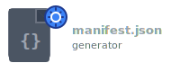

# Talon Pack




Catalogs your Talon repo's contributions and dependencies, generates version validation, and updates your README with badges.

> **Note:** Unofficial community tool.

## Usage

```bash
$ tpack [path]              # update manifest, _version, and readme
$ tpack info [path]         # list contributions, dependencies, and info
$ tpack version patch       # bump version (1.0.0 -> 1.0.1)
$ tpack help                # show all commands and options
```

## Getting Started

**1. Clone into your Talon directory:**

```sh
# mac and linux
cd ~/.talon

# windows
cd ~/AppData/Roaming/talon

git clone https://github.com/rokubop/talon-pack
```

**2. Set up an alias (pick one):**

Open your shell config file and add the alias below. Not sure which file? Run `echo $SHELL` - if it says `zsh`, use `~/.zshrc`; if `bash`, use `~/.bashrc`. To open it:

```bash
code ~/.zshrc  # or ~/.bashrc - use vim, notepad, open, or any editor
```
Uses Talon's bundled Python 3.13, so no extra Python install needed.

**Mac (Zsh)** - add to `~/.zshrc`:
```bash
alias tpack="/Applications/Talon.app/Contents/Resources/python/bin/python3 ~/.talon/talon-pack/tpack.py"
```

**Linux (Bash)** - add to `~/.bashrc`:
```bash
alias tpack="~/.talon/bin/python3 ~/.talon/talon-pack/tpack.py"
```

**Windows (Git Bash)** - add to `~/.bashrc`:
```bash
alias tpack="'/c/Program Files/Talon/python.exe' ~/AppData/Roaming/talon/talon-pack/tpack.py"
```

**Windows (WSL)** - add to `~/.bashrc`, replace `<YourUsername>` with your Windows username:
```bash
alias tpack="'/mnt/c/Program Files/Talon/python.exe' 'C:/Users/<YourUsername>/AppData/Roaming/talon/talon-pack/tpack.py'"
```

**Windows (PowerShell)** - run `notepad $PROFILE` and add:
```powershell
function tpack { & "C:\Program Files\Talon\python.exe" "$env:APPDATA\talon\talon-pack\tpack.py" @args }
```

**3. Reload your shell:**

```bash
source ~/.zshrc   # or ~/.bashrc
```

For PowerShell, restart your terminal or run `. $PROFILE`.

**4. Try it out:**

```bash
tpack info some_folder       # See what a folder contributes
tpack --dry-run some_folder  # Preview changes without writing
```

**5. Run it on your repo:**

```bash
tpack my_repo
```

🎉 Done! Keep your manifest up to date by running `tpack` whenever you make changes.

Having issues? See [Troubleshooting](#troubleshooting).

## Configuration
Edit `tpack.config.json` in the talon-pack directory to change default behavior:

```json
{
  "defaults": {
    "manifest": true,
    "version": true,
    "readme": true,
    "shields": false
  }
}
```

## Version Bumping

Bump the version in `manifest.json` using semver:

```bash
tpack version patch   # 1.0.0 -> 1.0.1
tpack version minor   # 1.0.0 -> 1.1.0
tpack version major   # 1.0.0 -> 2.0.0
```

## Scripts

Individual scripts can be run directly for specific tasks:

### generate_manifest.py
Parses Python and Talon files to detect Talon entities (actions, settings, tags, lists, modes, scopes, captures, and apps) you contribute or depend on. Scans user directory to find all other packages with manifests to build an index of available packages. Maps your imported entities to specific packages and their versions. Creates or updates `manifest.json` with all discovered information, preserving your manual edits to fields like name, description, etc.

```bash
tpack --manifest-only
python generate_manifest.py ../path-to-talon-repo
```

### generate_version.py
Generates a `_version.py` file that exposes your `manifest.json` package version as a Talon action e.g., `actions.user.my_package_version()`. Also includes automatic dependency validation on Talon startup, printing clear error messages if dependencies are missing or outdated with installation/update instructions for other packages that have a `{user.other_package}_version()` Talon action.

```bash
tpack --version-only
python generate_version.py ../path-to-talon-repo
```

### generate_readme.py
Creates or updates `README.md` files with shield badges, description, and installation instructions. For existing READMEs, only updates the shield badges (preserves your custom installation instructions). Automatically includes `preview.png` if it exists in the package directory.

```bash
tpack --readme-only
python generate_readme.py ../path-to-talon-repo
```

### generate_shields.py
Generates or updates shield badges in your `README.md` based on your `manifest.json`. Badges show package version, status, platform, license, and Talon Beta requirement (if applicable). If no README exists, prints badges to console for copy/paste.

```bash
tpack --shields-only
python generate_shields.py ../path-to-talon-repo
```

### generate_install_block.py
Outputs formatted installation instructions for your package based on your `manifest.json`, including dependency information. Useful for quickly generating README installation sections. Only supports single directory.

```bash
tpack --install-block-only
python generate_install_block.py ../path-to-talon-repo
```

### Additional notes
All scripts support `--dry-run` to preview changes without writing files. You can also provide multiple folders: `tpack repo-1 repo-2`

## Example `manifest.json`

```json
{
  "name": "talon-my-package",
  "title": "My Package",
  "description": "A brief description of what the package does",
  "version": "1.0.0",
  "status": "experimental",
  "namespace": "user.my_package",
  "github": "https://github.com/user/talon-my-package",
  "preview": "",
  "author": "Your Name",
  "tags": ["productivity", "editing"],
  "license": "MIT",
  "dependencies": {
    "talon-ui-elements": {
      "min_version": "0.13.0",
      "namespace": "user.ui_elements",
      "github": "https://github.com/user/talon-ui-elements"
    }
  },
  "devDependencies": {},
  "contributes": {
    "settings": [
      "user.my_package_setting_1",
      "user.my_package_setting_2"
    ],
    "actions": [
      "user.my_package_action_1",
      "user.my_package_action_2",
      "user.my_package_version"
    ],
  },
  "depends": {
    "actions": ["user.ui_elements_show"]
  },
  "validateDependencies": true,
  "_generator": "talon-pack",
  "_generatorVersion": "3.0.0",
  "_generatorRequiresVersionAction": true,
  "_generatorStrictNamespace": true,
  "_generatorFrozenFields": [],
}
```

## Example `README.md`

``````md
# {manifest.title}


{manifest.description}

## Installation

Clone this repo into your [Talon](https://talonvoice.com/) user directory:

```sh
# mac and linux
cd ~/.talon/user

# windows
cd ~/AppData/Roaming/talon/user

git clone {manifest.github}
```
``````

## Example `_version.py` (no dependency check)

```py
"""
DO NOT EDIT - Auto-generated file
Generated by talon-pack v3.0.0

This file provides:
- Package version checking via parrot_tester_version() action
- Automatic dependency validation on startup
"""
import json
from pathlib import Path
from talon import Module, actions, app

mod = Module()

_cached_version = None

def _get_version() -> tuple[int, int, int]:
    """
    Loads version from manifest.json. Cached after first successful load.
    To reload: restart Talon or save this file
    """
    global _cached_version
    if _cached_version is not None:
        return _cached_version

    try:
        with open(Path(__file__).parent / 'manifest.json', 'r', encoding='utf-8') as f:
            version = tuple(map(int, json.load(f)['version'].split('.')))
            _cached_version = version
            return version
    except Exception as e:
        print(f"ERROR: talon-parrot-tester failed to load version from manifest.json: {e}")
        return (0, 0, 0)

@mod.action_class
class Actions:
    def parrot_tester_version() -> tuple[int, int, int]:
        """
        Returns the package version as (major, minor, patch).

        Usage: actions.user.parrot_tester_version() >= (1, 2, 0)
        """
        return _get_version()
```

## Example `_version.py` (with dependencies)
```py
def validate_dependencies():
    """
    Checks dependencies from manifest.json and calls {namespace}_version()
    for each to verify installed versions meet requirements on Talon startup.

    Prints warnings to Talon log when dependencies are missing or outdated,
    including installation/update instructions. Can be disabled by setting
    'validateDependencies': false in manifest.json.
    """
    try:
        manifest_path = Path(__file__).parent / 'manifest.json'
        with open(manifest_path, 'r') as f:
            data = json.load(f)

        if not data.get('validateDependencies', True):
            return

        deps = data.get('dependencies', {})
        errors = []

        for dep, info in deps.items():
            version_action_name = f"{info.get('namespace')}_version"
            github_url = info.get('github', '')
            version_str = info.get('min_version') or info.get('version')
            try:
                version_action = actions
                for part in version_action_name.split('.'):
                    version_action = getattr(version_action, part)
                installed = version_action()

                if not isinstance(installed, tuple):
                    installed = tuple(int(x) for x in str(installed).split('.'))

                required = tuple(int(x) for x in version_str.split('.'))
                if installed < required:
                    installed_str = '.'.join(map(str, installed))
                    errors.append(f"  Update {dep} to {version_str}+ (currently {installed_str})")
                    if github_url:
                        errors.append(f"    Navigate to the {dep} directory and run: git pull")
                        errors.append(f"    {github_url}")
                    errors.append("")
            except Exception as e:
                errors.append(f"  Cannot verify {dep} {version_str}+ (missing or invalid {version_action_name} action)")
                if github_url:
                    errors.append(f"    Install/update from: {github_url}")
                errors.append(f"    {e}")
                errors.append("")

        if errors:
            print(f"============================================================")
            print(f"{data.get('name')}: dependency requirements not met\n")
            for error in errors:
                print(error)
            print("  WARNING: Review code from unfamiliar sources before installing")
            print("  Note: You may need to restart Talon after updating")
            print("  To disable these warnings:")
            print(f"    Set 'validateDependencies': false in {manifest_path}")
            print(f"============================================================")
    except:
        pass

app.register("ready", validate_dependencies)
```

## Example Talon log (dependency not met)

### Missing
```
2026-01-20 23:20:16.971    IO ============================================================
2026-01-20 23:20:16.971    IO talon-parrot-tester: dependency requirements not met
2026-01-20 23:20:16.971    IO
2026-01-20 23:20:16.971    IO   Cannot verify talon-ui-elements 0.13.0+ (missing or invalid user.ui_elements_version action)
2026-01-20 23:20:16.971    IO     Install/update from: https://github.com/rokubop/talon-ui-elements
2026-01-20 23:20:16.971    IO     "Action 'user.ui_elements_version' is not declared."
2026-01-20 23:20:16.971    IO
2026-01-20 23:20:16.971    IO   WARNING: Review code from unfamiliar sources before installing
2026-01-20 23:20:16.972    IO   Note: You may need to restart Talon after updating
2026-01-20 23:20:16.972    IO   To disable these warnings:
2026-01-20 23:20:16.972    IO     Set 'validateDependencies': false in talon-parrot-tester/manifest.json
2026-01-20 23:20:16.972    IO ============================================================
```

### Outdated
```
2026-01-20 23:17:18.112    IO ============================================================
2026-01-20 23:17:18.112    IO talon-parrot-tester: dependency requirements not met
2026-01-20 23:17:18.112    IO
2026-01-20 23:17:18.112    IO   Update talon-ui-elements to 0.13.0+ (currently 0.12.2)
2026-01-20 23:17:18.112    IO     Navigate to the talon-ui-elements directory and run: git pull
2026-01-20 23:17:18.112    IO     https://github.com/rokubop/talon-ui-elements
2026-01-20 23:17:18.113    IO
2026-01-20 23:17:18.113    IO   WARNING: Review code from unfamiliar sources before installing
2026-01-20 23:17:18.113    IO   Note: You may need to restart Talon after updating
2026-01-20 23:17:18.113    IO   To disable these warnings:
2026-01-20 23:17:18.113    IO     Set 'validateDependencies': false in talon-parrot-tester/manifest.json
2026-01-20 23:17:18.113    IO ============================================================
```

### Manifest Fields

| Field | Description |
|-------|-------------|
| name | Package identifier (defaults to folder name, preserved on updates). Recommendation for folder & name: prefix with "talon-". |
| title | Human-readable package title. Recommendation: "Title Case" format |
| description | Brief description of package functionality |
| version | Semantic version number (major.minor.patch) |
| namespace | Naming prefix for all talon actions in this package (e.g. `user.ui_elements` means all actions in this package are `user.ui_elements_*`). Best practice: all your actions should use the same namespace. Set `_generatorStrictNamespace` to false to allow multiple namespaces and skip validation warnings. |
| github | GitHub repository URL |
| preview | Optional URL to preview image. Auto-detected if a file matching `preview.*` exists in package directory (converts to raw GitHub URL). |
| author | Package author name (string) or names (list of strings) |
| status | Package status/category. Can be any value, but these get automatic shield colors: "reference" (personal config/examples, not meant to be used directly), "prototype" (proof of concept, testing ideas), "experimental" (early stage, expect rough edges), "preview" (functional but still improving), "stable" (production-ready, safe to depend on), "deprecated" (stop using, migrate to alternative), "archived" (no longer maintained) |
| tags | Arbitrary category tags for the package |
| platforms | Platform compatibility (manually added, optional). Array of platform names, e.g. `["windows", "mac", "linux"]`. |
| license | License type (auto-detected from LICENSE file on first run, manually editable, optional). Only included if LICENSE file exists or manually set. Common values: MIT, Apache-2.0, GPL-3.0, BSD-3-Clause, ISC, Unlicense |
| requires | Auto-detected hardware/software requirements. Possible values: `"talonBeta"`, `"eyeTracker"`, `"parrot"`, `"gamepad"`, `"streamDeck"`, `"webcam"`. Example: `["talonBeta", "eyeTracker"]`. Add `"requires"` to `_generatorFrozenFields` to preserve manual edits. |
| dependencies | Auto-generated. Required packages (other packages that also have `manifest.json` and `_version.py` generated by this generator) as dict mapping package name to object with `min_version`, `namespace`, and `github` fields. Once set, versions are preserved - update manually if needed. |
| devDependencies | Dev-only dependencies (manually move items here from `dependencies` if only needed for testing/development) |
| contributes | Auto-generated. Actions/settings/tags/modes/etc. this package provides |
| depends | Auto-generated. Actions/settings/tags/modes/etc. this package uses |
| validateDependencies | Whether to validate dependencies on Talon start (default: true if dependencies exist, omitted otherwise). Set to false to disable dependency validation. |
| _generator | Generator e.g. "talon-pack" |
| _generatorVersion | Version of the generator |
| _generatorRequiresVersionAction | Whether the generator should require a version action (default: true if namespace exists). Set to false to disable version action requirement check |
| _generatorStrictNamespace | Whether the generator should validate namespace consistency (default: true). Set to false to allow multiple namespaces and skip validation warnings. Useful for collection packages like talon-community |
| _generatorFrozenFields | Array of field names to prevent from being auto-updated. e.g.: `"requires"`, `"license"`, `"contributes"`, or sub-fields like `"contributes.actions"`, `"depends.tags"`, etc |
| _generatorShields | Whether to generate/update shield badges in README.md (default: true). Set to false to disable automatic shield generation. |

Most fields are preserved across regenerations, but `contributes`, `depends`, and `dependencies` (except for `version`) are auto-generated each time.

## Troubleshooting

### Using Your Own Python

The default aliases use Talon's bundled Python. If you prefer your own Python, it must be **3.12 or higher**:

```bash
# Mac/Linux
alias tpack="python3 ~/.talon/talon-pack/tpack.py"

# Windows (PowerShell)
function tpack { py "$env:APPDATA\talon\talon-pack\tpack.py" @args }

# Windows (Git Bash)
alias tpack="py ~/AppData/Roaming/talon/talon-pack/tpack.py"
```
